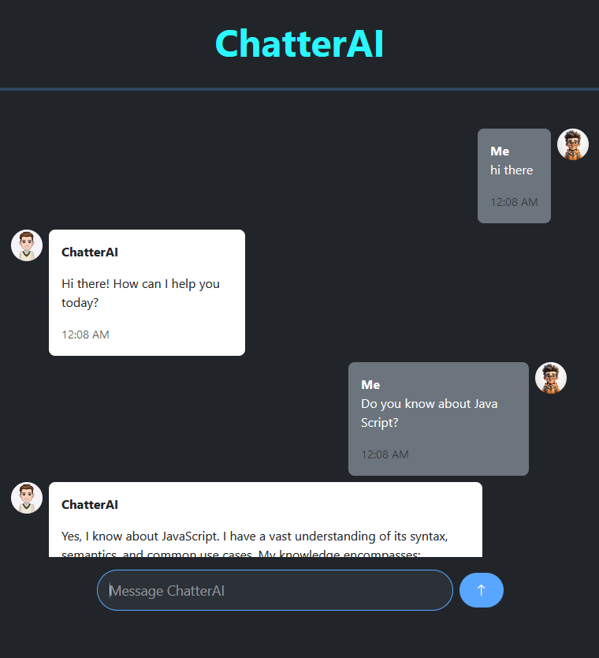

# **ChatterAI**

## **Overview**
ChatterAI is an interactive web-based chat application that allows users to engage in real-time conversations with an AI chatbot. The chatbot utilizes the Gemini AI model to generate contextually relevant responses, making it a powerful tool for seamless communication. The app features a modern user interface with an interactive message system, real-time AI responses, and a smooth experience for users.

---

## **Features**
- **Real-time Messaging**:
  - Users can send text messages that are instantly processed and responded to by the AI.
- **AI Responses**:
  - Uses the Gemini AI model to generate responses based on user input.
- **Message Display**:
  - Messages from the user and AI are displayed in a clean, conversational format.
- **Typing Indicator**:
  - Displays a "typing..." indicator while waiting for the AI response.
- **Responsive Design**:
  - Built with Bootstrap for a user-friendly interface that works across devices.
- **Message Timestamps**:
  - Every message is timestamped for better context.
  
---

## **Technologies Used**
- **Programming Languages**: HTML, CSS, JavaScript
- **Framework**: Bootstrap
- **AI Integration**: Google Gemini AI for generating responses
- **Markdown Rendering**: Markdown-It for rendering formatted text
- **API**: Google Gemini AI API for conversational responses

---

## **How It Works**
1. **User Message**: The user types a message and hits Enter or clicks the send button.
2. **AI Processing**: The user's message is sent to the AI, and the response is fetched asynchronously.
3. **Display Conversation**: Both user and AI messages are displayed in a chat-like format. A typing indicator is shown while the AI is processing the response.
4. **Real-time Interaction**: The app provides a real-time chat experience without page reloads.

---

## **Code Breakdown**
### **Message Handling**
The chat interface dynamically adds messages as they are sent or received:
- **send()**: Sends the user's message and waits for an AI response.
- **addMessage()**: Adds either user or AI messages to the chat window, with different styles and avatars.
- **addTypingIndicator()**: Displays a "typing..." indicator while the AI is formulating a response.
- **removeTypingIndicator()**: Removes the typing indicator once the AI responds.

### **AI Response**
The app integrates with the Gemini AI API:
- The user’s message is sent to the API endpoint.
- The AI processes the message and returns a generated response, which is then displayed to the user.

### **Time Handling**
Each message includes a timestamp to show the time it was sent. The `getTime()` function formats the time in a 12-hour AM/PM format.

---

## **Usage**
1. **Enter Message**: Type your message into the input box at the bottom of the chat window.
2. **Send Message**: Press the **Enter** key or click the **Send** button to send your message.
3. **View Response**: The AI's response will appear after a brief typing indicator.
4. **Interaction**: Continue the conversation with the AI by typing additional messages.

---

## **Screenshots**

---

## **Contributing**
Contributions are welcome! If you'd like to enhance this project, feel free to fork the repository and submit a pull request. Please ensure that your code adheres to best practices.

---

## **License**
This project is licensed under the MIT License. See the LICENSE file for more details.

---

## **Credits**
- **Developer**: Nipun Basnayake
- **Libraries and Tools**:
  - Bootstrap for UI
  - Gemini AI for chat responses
  - Markdown-It for message formatting

---

## **Contact**
For feedback, questions, or collaboration, reach out to:
- Email: [nipunsathsara1999@gmail.com](mailto:nipunsathsara1999@gmail.com)
- GitHub: [NipunBasnayake](https://github.com/NipunBasnayake)
